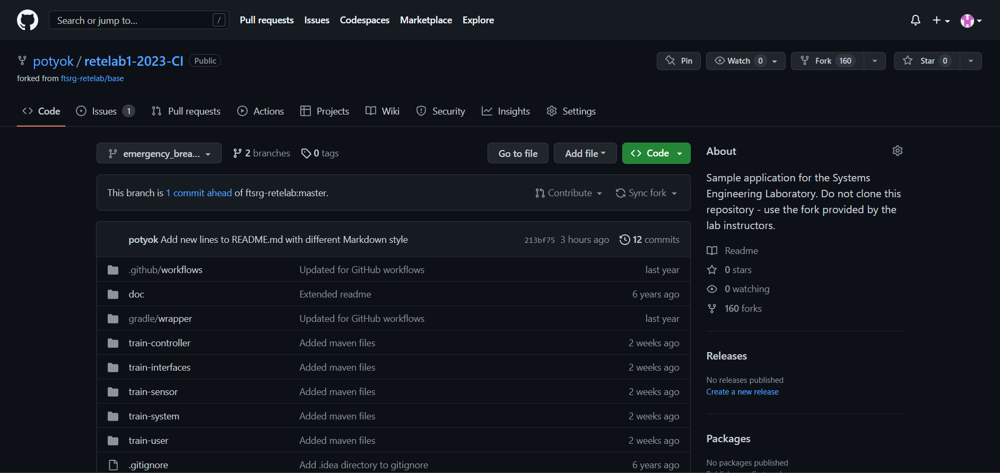

# 1. Feladat
Beléptem a kari felhőben található virtuális gépre, majd leellőríztem, hogy a megfelelő komponensek elérhetőek e rajta.

# 2. feladat
Elkészítettem a fork-ot a megadott kiindulási repository-ból, illetve a leírásnak megfelelően kigeneráltam az Access Token-t, amelynek lejárata 2023. május 16-a lett.

# 3. feladat
## 3.1. feladat

Kiadtam a git clone parancsot, amellyel leklónoztam a repository-m tartalmát.

## 3.3. feladat

Elvégeztem a README.md fájl kommitálását, melyhez először beállítottam a user.email és user.name értékeit az én elérési adataimra. Ezután pedig a token megfelelő beállítása után felpusholtam a változtatásokat.

# 4. feladat
## 4.1. feladat

Feladtam egy Issue-t azzal kapcsolatban, hogy a vészfékezés lehetőségét a jelenlegi rendszer nem kezeli és javasoltam erre egy megoldási lehetőségét.

## 4.2. feladat

Létrehoztam az emergency_breaking_feature branch-et a webes felület az Issue megoldására.

## 4.3. feladat

Átléptem az emergency_breaking_feature branch-re a megfelelő git paranccsal,miután pull-oltam a repository-t.

## 4.5. feladat

Elkészítettem az implementációt, majd lefuttattam a mvn test parancsot, az új komponens teszteléséhez készítettem egy új tesztet, amelyben a user-en meghívtam az új pushEmergencyBreak metódus, amely eléri, hogy a referencia sebesség beálljon 0-ra a joystick állítása nélkül.

## 4.6. feladat

A helyes implementációt felpusholtam a repostory-ba.

## 4.7. feladat

Elindítottam egy pull-requestet, amelyben megadtam a megadott hivatkozást.

## 4.8. feladat

Merge-eltem a beadott pull-requestet, illetve töröltem a feature miatt létrehozott brach-et.

## 4.9. feladat

A git pull paranccsal lepulloltam a változtatásokat, majd a git log parancs kiadásával megkaptam a végbemenő változtatásokat.

# 5. feladat
## 5.1. feladat

Létrehoztam a git branch <new_branch> parancs segítségével a branch-A és branch-B branch-eket, majd a git branch parancs megnéztem, hogy valóban létrejöttek-e az ágak.

## 5.2. feladat

A README fájlba a 81-82 sorokba beleírtam egy kommentet a merge-konflikt előkészítéséhez és commitáltam.

## 5.3. feladat

A README fájlba ismét a 81-82 sorokba beleírtam egy kommentet a merge-konflikt kialakításához és commitáltam.

## 5.4. feladat

Bemergeltem mindkét ágat és megkaptam a merge-konfliktus hibát, amelyet úgy kezeltem, hogy végül csak az branch-A változtatásait tartottam meg.

## 6.4. feladat

Elnavigáltam az Actions fülre és ott a megfelelő konfigurációra kattintottam a java verziót pedig a képen látható részben találtam meg, ahol a megfelelő java verzió látható a feladat szempontjából.

## 6.5. feladat

Elsőre hibával zárult az Action, mert benne maradt egy opcionális rész, ami hibát dobott, de azt eltávolítottam és utána már sikeresen lefutott a build.

## 6.6. feladat

Megnyitottam a Build with Maven szekciót és megkerestem a tesztekkel kapcsolatos részt, amit korábban a mvn test parancs lefuttatásakor is már láttam.

## 6.7. feladat

Javítottam az egyik tesztet, valamint átírtam a vészfékezéssel kapcsolatos implementációt és az elvártnak megfelelően fennakadt a teszten a hiba.

## 6.8. - 6.9. feladat

Kijavítottam a hibát és hozzáadtam egy új tesztet a korábbi tesztekhez és most sikeresen lefutott minden teszt és a build is sikeres volt.

# 7.feladat
## 7.4. feladat

Hozzáadtam a Tachograph osztályt modulként a projekthez, majd kipróbáltam, hogy működik-e megfelelően az érték hozzáadás, majd az onnan való vissza olvasás. Az eredmény a képen látható.

## 7.5. feladat

Észrevettem, hogy a tachograph mappát elfelejtettem feltölteni a repository, ezért a git add és git commit parancsok segítségével fel vettem a megfigyelt dokumentumok körébe, majd a git push művelet után az Actions fülön már a teljesen lefutott buildet kaptam eredményül.

# 8. feladat
## 8.1. feladat

Hozzáadtam a maven.yml fájlhoz a megadott flaget, majd a lefutás után azt tapasztaltam, hogy valóban eltűnt a Build with Maven szekcióból az összes olyan sor, ami letöltést tartalmaz.

## 8.2. feladat

Hozzáadtam a megadott linken található cahce-t megvalósító parancsot és lefuttattam kétszer az Action-t másodjára már látható volt a cachelés eredménye, amit a kép is mutat.
