# 2. feladat
Létrehoztam a feature_reference_speed_controlling branch-et a viselkedés megvalósításához. Ezután elkészítettem a saját implementációt, amely a java Thread osztályt használja.

# 2.1. feladat
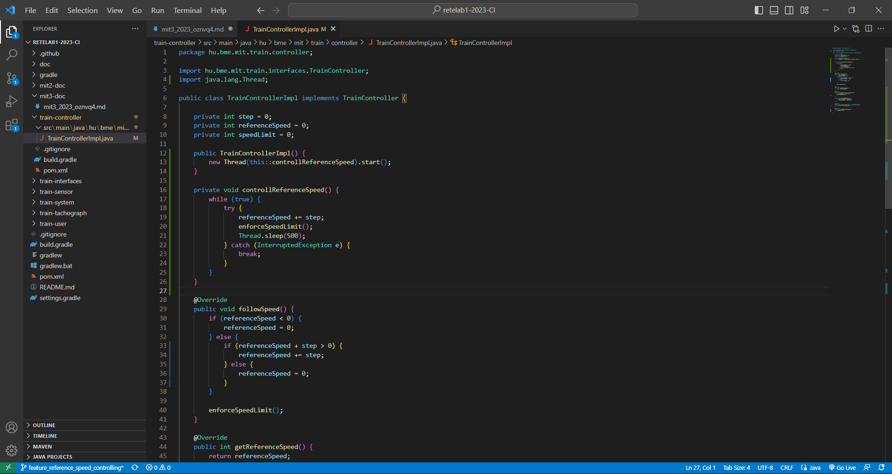
A megoldásomhoz készítettem egy segéd metódust, amelyben egy while ciklusban 500 ms időközönként megváltoztatom a referencia sebességet a beállított joystick beállításával. Illetve lekezelem, hogy ne menjem a megendegett határ felé, ezt az erre már megírt metódussal értem el.

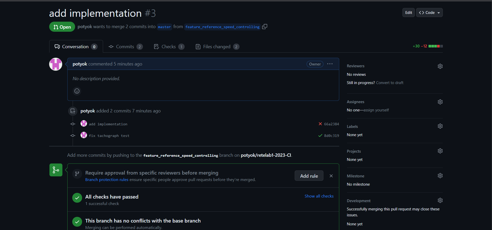
Készítettem egy pull requestet és közben kiderült a számomra, hogy a korábbi laboron a tachográf tesztjében benne maradt egy olyan viselkedés, ami még a régi referenciasebesség működését használta ki, de ezt kijavítottam és így már a korábbi teszteken át ment a megírt kódom.

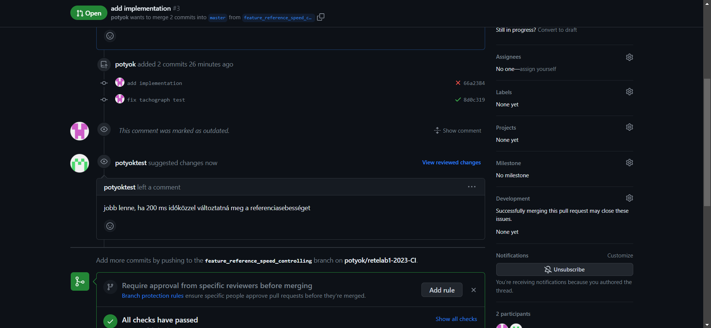
Egy másik github-os felhasználomról elkészítettem egy változtatási lehetőséget.

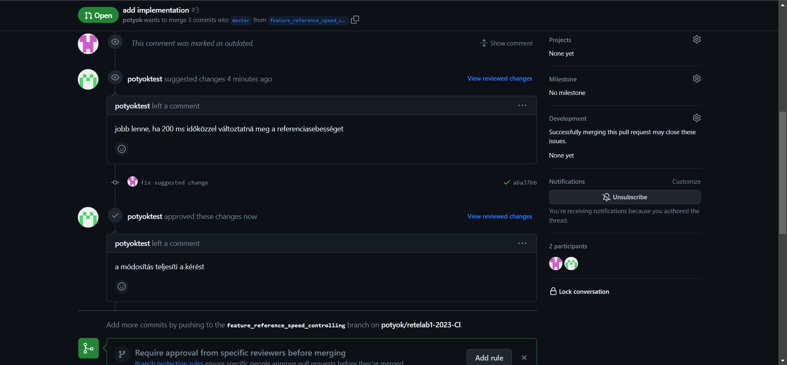
Elvégeztem a módosítást majd commitoltam azt, ezután pedig a másik fiókomról Approve-oltam a változtatást. Ezek után merge-ltem a változtatást és töröltem a létrehozott feature branch-et.

# 2.2. feladat
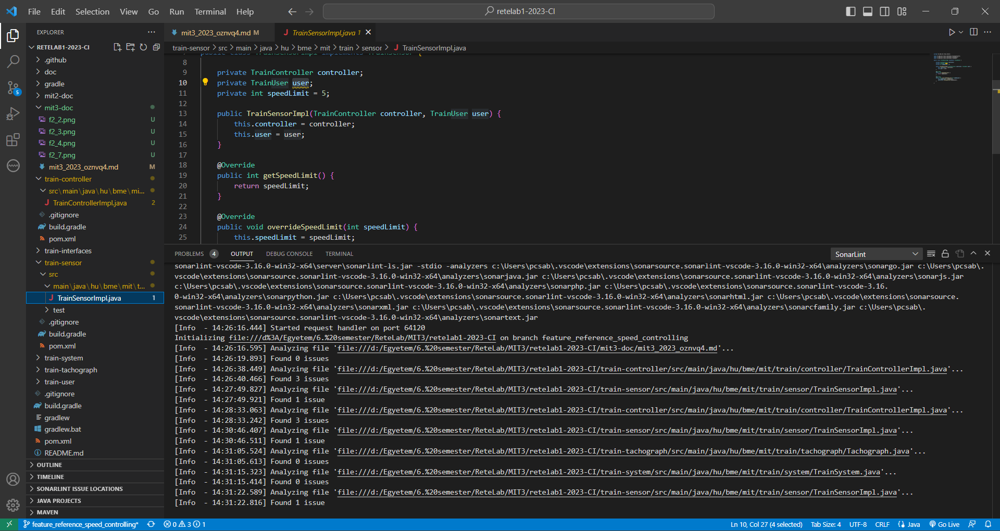
A Sonarlint segítségével több hibát is találtam. Az egyik ilyen, amit a kép is mutat, amely arra hívja fel helyesen a figyelmet, hogy privát user tagváltozó nincs használatban, ez teljesen igaz, mert alapvetően sosem lehet lekérdezni, és csak a konsruktor állítja be az értékét, de utána semmilyen metódus nem használja.

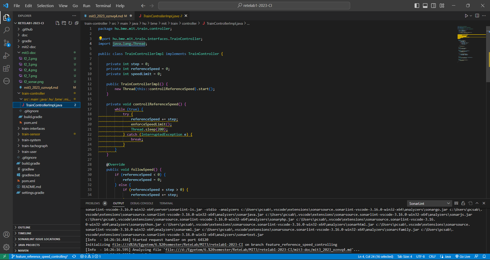
Illetve az újonnan bevitt változtatásban is talált hibákat, amelyek jogosnak tűnnek a hozzájuk leírt szabályok alapján.

# 2.3. feladat

A leírtak szerint elkészítettem a SonarCloudos összekapcsolást és megadott helyeken elvégeztem a módosításokat. Ennek megfelelően a SonarCloud oldalán megtaláltam az általam készített snapshotot, amelyet a kép is mutat.

# 3. feladat
# 3.1. feladat
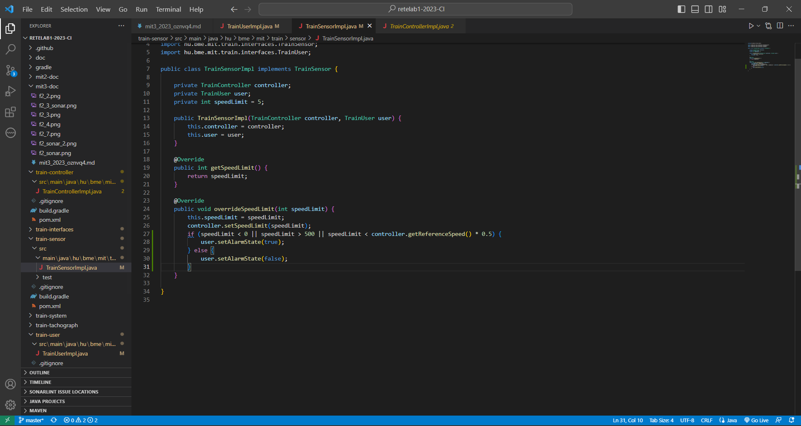
A leírtak megfelelően kibővítettem a TrainUser és TrainSensor osztályok implementációit a megadott viselkedéssel.

# 3.2. feladat

## 1. Teszt eset - Negatív sebesség korlát
Leírás: A teszt során vizsgáljuk, hogy ha véletlenül negatív sebesség korlát lenne beállítva, akkor azt a rendszer az elvártnak megfelelően az alarm mód bekapcsolásával jelezné.

Előfeltétel: - 

Lépések: 
- Beállítjuk az overrideSpeedLimit metódus értékét -1-re.
- Leellenőrízzük, hogy user-ben beállítódik a alarm mód igazra.

Elvárt: A beállítás után váltson igazra az alarm mód a user esetén.

## 2. Teszt eset - Túl magas sebesség korlát
Leírás: A teszt során vizsgáljuk, hogy ha véletlenül túl magas (500 feletti) sebesség korlát lenne beállítva, akkor azt a rendszer az elvártnak megfelelően az alarm mód bekapcsolásával jelezné.

Előfeltétel: -

Lépések: 
- Beállítjuk az overrideSpeedLimit metódus értékét 501-re.
- Leellenőrízzük, hogy user-ben beállítódik a alarm mód igazra.

Elvárt: A beállítás után váltson igazra az alarm mód a user esetén.

## 3. Teszt eset - Túl nagy eltérés a referencia sebességhez képest
Leírás: A teszt során vizsgáljuk, hogy ha véletlenül 50%-nál nagyobb a sebesség csökkentés a sebesség korlát megadása miatt, akkor azt a rendszer az elvártnak megfelelően az alarm mód bekapcsolásával jelezné.

Előfeltétel: A jármű referencia sebessége és a korlát sebesség is 150.

Lépések: 
- Beállítjuk az overrideSpeedLimit metódus értékét 50-re.
- Leellenőrízzük, hogy user-ben beállítódik a alarm mód igazra.

Elvárt: A beállítás után váltson igazra az alarm mód a user esetén.

## 4. Teszt eset - Szabályos limit beállítás
Leírás: A teszt során vizsgáljuk, hogy ha az abszolút és relatív szabályokat betartva módosítjuk a sebesség korlátot, akkor a rendszer nem jelez be a user-nél.

Előfeltétel: A jármű referencia sebessége és a korlát sebesség is 150.

Lépések: 
- Beállítjuk az overrideSpeedLimit metódus értékét 100-re.
- Leellenőrízzük, hogy user-ben nem állítódik be az alarm mód igazra.

Elvárt: A beállítás után ne váltson igazra az alarm mód a user esetén.

## Megvalósítás
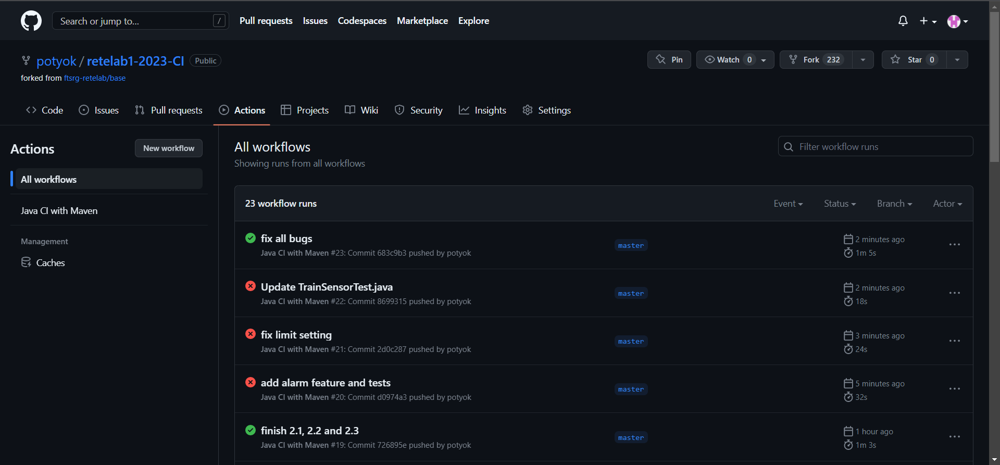
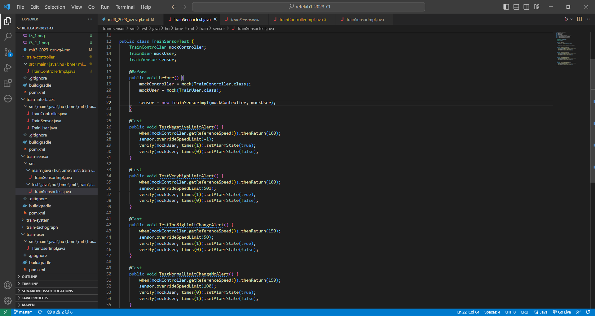
Elkészítettem a teszteket és lefuttattam őket, volt pár elírás a tesztekben, amelyeket utólag vettem észre és ezeket a workflow lefuttatásával szépen kiszűrtem, de magával a viselkedés ellenőrzésével nem találtam hibát az implementációban.

# 3.3. feladat
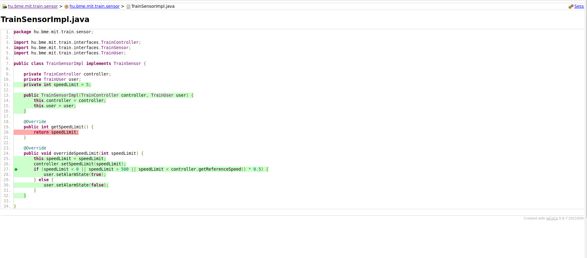
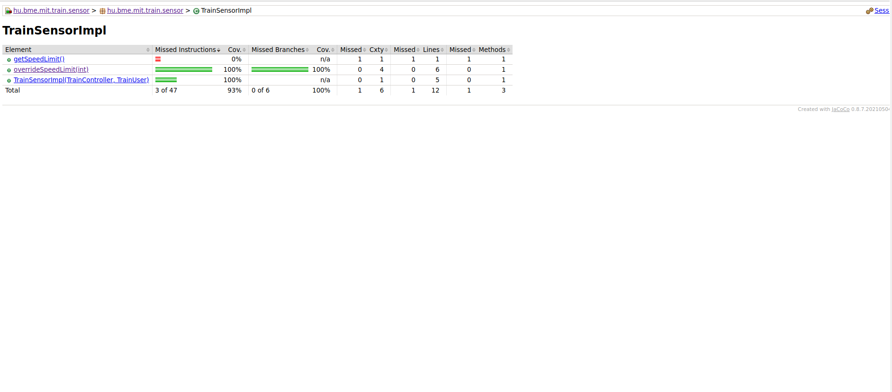
Beilleszttem a pom.xml-be a megfelelő sorokat, majd kiadtam a parancsot. Megvizsgáltam az index.html tartalmát, amiben azt találtam, hogy a sensor overrideLimitSpeed metódusát teljes tesztlefedettséggel teszteltem le.